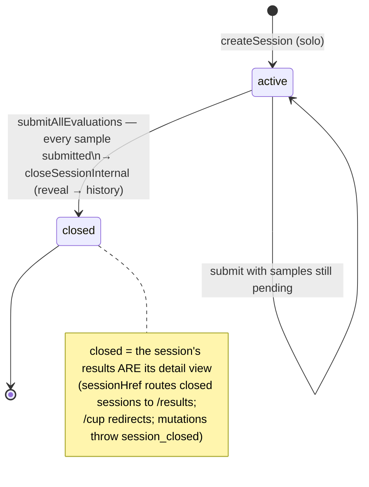
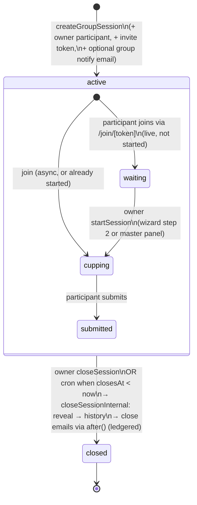
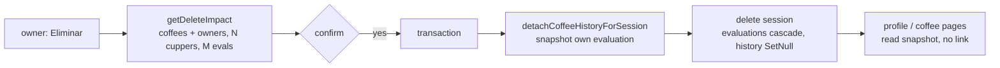
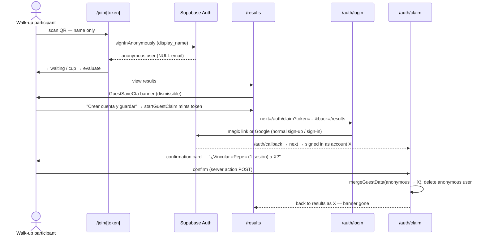
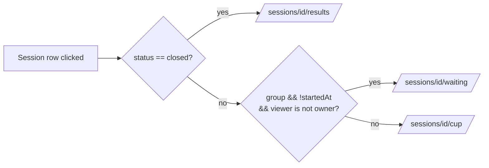
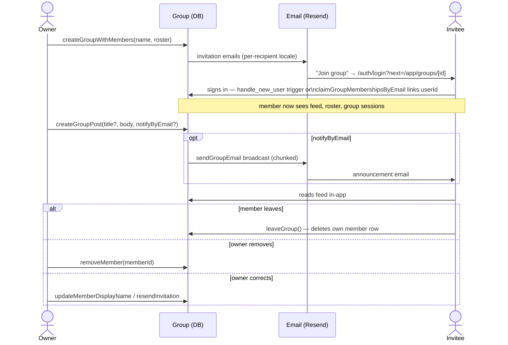

# Cata Café — Application Flows

> **These diagrams are normative.** They describe how the app is *supposed* to behave.
> Update this file **in the same PR** as any change to a flow it documents — a stale
> diagram is worse than none. (Introduced 2026-08-05 with the app-cohesion overhaul.)

Quick orientation: **Sessions** are events, **Coffees** are reusable assets,
**Groups** are standing rosters, and **UserCoffeeHistory** is the connective tissue
that turns closed sessions into per-user coffee track records.

---

## 1. Session lifecycle

Who can do what: the session **owner** (creator) has full CRUD — edit metadata,
manage samples (with guards), reveal, close, delete. A **participant** can only
evaluate and view results. Deleting a session cascades **all participants'
evaluations**, physical/extrinsic data, invites, and its tasting-history rows.

### The one close routine (2026-09-08)

Every path that ends a session goes through `closeSessionInternal`
(`lib/closeSession.ts`): **idempotent** status flip (`updateMany where status
!= closed`, stamps `closedAt`) → **reveal every coffee-linked sample** → 
`syncCoffeeHistoryForSession` → close emails (group only). A second click, a
concurrent call or a cron retry is a no-op — nothing is re-synced or re-sent.
Once closed, a session is **read-only**: every mutation runs
`assertSessionWritable` and throws `session_closed`; `/cup` redirects to
`/results`; offline drafts for a closed session are discarded on replay.

### Solo sessions

`createSession` sets `status: "active"` immediately (there is no meaningful
"draft" for solo). The session **auto-closes** when the owner has a *submitted*
evaluation for **every** sample (`maybeAutoCloseSoloSession` inside
`submitAllEvaluations`, `app/actions/community.ts`, `emails: "skip"`).



### Group sessions (live and async)

`createGroupSession` starts at `active`, creates the owner's participant row and
an invite token, and (optionally) emails the linked group. Participants join via
`/join/[token]` (owner and existing members re-opening the link are no-ops; a
closed session's link sends members to results and refuses newcomers; `maxUses`
is enforced inside the transaction). For a **live** session they wait in
`/waiting` until the owner calls `startSession` — from wizard step 2 **or** the
master panel's "Iniciar cata" (idempotent). An **async** session (`isAsync`,
`closesAt` set) lets them cup immediately and is closed by the **daily cron**
(`/api/cron/close-expired-sessions`, 06:00 UTC) once `closesAt` passes, or
earlier by the owner. Close emails are queued with `after()` and ledgered per
recipient in `close_email_deliveries`; the owner sees sent / no-email / failed /
pending on the results page and can "Reenviar" (only unsent recipients go out).



### Deleting a session (2026-09-08)

The owner may delete a session at any time. The confirm dialog (fed by
`getDeleteImpact`) lists the coffees involved **with their owners** — coffee
records and their statistics belong to those owners and are never touched — and
states how many cuppers' evaluations will go. Inside the same transaction,
`detachCoffeeHistoryForSession` first guarantees every cupper a
`UserCoffeeHistory` row per coffee-linked sample they submitted (revealed or
not) carrying a `snapshot` of **their own** evaluation + session metadata; then
the session is deleted and the history rows' `sessionId`/`evaluationId` go
`NULL` (`SetNull`) instead of cascading away. Profile history, coffee detail and
the dashboard read `snapshot` for those rows and label them "Sesión eliminada".



### Guest join & conversion (email capture)

`/join/[token]` requires no account: a walk-up participant enters only a display
name (`GuestJoinForm` → `supabase.auth.signInAnonymously()` →
`completeGuestOnboarding` → `joinViaToken`). Their evaluations belong to an
anonymous auth user (NULL email). On the **results** page an anonymous viewer
sees a dismissible "Guarda tus resultados" banner (`GuestSaveCta`). It reuses
the **normal account-creation flow** rather than inventing one: `startGuestClaim`
mints a signed 7-day claim token for the anonymous id and sends the guest to
`/auth/login?next=/auth/claim?token=…` (magic link or Google — the same
double-opt-in every account gets). After sign-in, `/auth/claim` shows a
confirmation card naming the guest participation (never merges on a GET);
confirming runs `mergeGuestData` (`lib/guestClaim.ts`) which moves every row
the anonymous user owns — evaluations, participation, coffee history, created
sessions… — onto the signed-in account (**new or already existing**), deletes
the anonymous user, and returns to the results page. Never gate *joining* on an
email — valor antes que fricción (see PRODUCT.md).



### Where a session link takes you (`lib/sessionRouting.ts`)



Every list (sessions, dashboard, profile, group page) must use `sessionHref` —
never hardcode `/cup`.

### Sample / coffee metadata lifecycle (progressive)

Creation only requires a **name** — the wizard and coffee forms range-check
altitude only when a value is given, and roast level is optional (*valor antes
que fricción*: name-only entry, everything else fillable later). Metadata can
then be edited at any point in a sample's life: coffee fields + label via
`EditSampleMetadataForm` (from the cup page and the results drill-down), and
origin/processing data post-close via `ExtrinsicEditDialog` on the results
drill-down (owner + revealed samples only). Both routes go through `updateSampleMetadata` /
`upsertExtrinsic`, which **merge** rather than overwrite — an absent key
leaves the coffee field untouched, `""` clears it, `name` is never blanked —
and report `coffeeUpdated: false` (shown as a dismissible notice) when the
linked coffee isn't owned by the editor.

### Reference sample (2026-09)

The owner may mark exactly one sample per session as the "Referencia" (control
sample the others are compared against) from the wizard, the sample edit page,
or the cup page's master panel — `CuppingSession.referenceSampleId` (nullable,
`SET NULL` on sample removal, remapped by position on `duplicateSession`) via
the owner-only `setReferenceSample` action. It goes live to participants
through the existing `cupping_sessions` realtime UPDATE stream — no new
publication or RLS policy. Results and the PDF/print sheets show a
"Referencia" badge on that sample and a display-only signed Δ against it
(community score in group sessions, own CVA score solo) computed by
`lib/referenceDelta.ts`; scoring itself, the DB trigger, and RLS are untouched.

**2026-09-25 — reference cupped first, pinned quality:** three rules layered on
top of the above, all in `lib/referenceRules.ts`. **Order:** the reference is
cupped FIRST — `orderReferenceFirst` puts it ahead of the rest (who keep their
position order) everywhere samples are listed: cup tabs and Anterior/Siguiente,
the waiting room, results tables/radar/owner matrix, the CVA PDF, print, and
close emails. Changing the reference mid-session swaps the order live for
everyone and keeps each cupper on the sample they were viewing. **Pin:** on the
reference sample, every affective attribute is locked at 5 and the cup checks
are cleared, so every cupper's reference score is exactly 79.00 and only the
descriptive side stays editable (affective/combined formats only — enforced
server-side on every save via `pinReferenceAffective`, mirrored client-side as
a locked, explained UI). Existing scores entered before the lock are never
rewritten. **Anchor:** results treat the reference as context, not a
competitor — it is pulled out of the ranking, the session average and "Mejor
muestra" into its own card above the ranking; the Δ against it is unchanged.

---

## 2. Coffee visibility & sharing

A coffee is a reusable asset owned by its creator (producer/roaster/café). The
owner has full CRUD (`createCoffee`, `updateCoffee`, `deleteCoffee`,
`setCoffeeVisibility`, `setCoffeeResultsPublished`); everyone else only *uses*
usable coffees in sessions. Two independent switches: `visibility` (who sees the
record) and `resultsPublished` (who sees the aggregated results block).

```mermaid
flowchart TD
    subgraph states [visibility]
        P[private] -- "createCoffeeInvite()\n(link mints ⇒ intent to share)" --> S[shared]
        S -- setCoffeeVisibility --> PUB[public]
        S -- "setCoffeeVisibility(private)\nshare rows stay but go INERT" --> P
        PUB -- setCoffeeVisibility --> S
    end
    S -- "join link /join/coffee/[token]" --> CS[CoffeeShare row\n(per user)]
    CS --> U[usable by that user]
    PUB --> U2[usable by everyone]
    P --> U3[usable by owner only]
```

`usableCoffeeWhere(userId)` (`lib/coffeeAccess.ts`) is the single read rule:
owned ∪ public ∪ (shared ∧ has share row). The session wizard and
`addSessionSample` both re-validate picked coffees against it server-side.

**Delete blast radius:** `session_samples.coffeeId` → SET NULL (samples keep
their blind label; sessions and evaluations survive), but `user_coffee_history`
→ CASCADE for **every user who ever cupped it**. The confirm dialog says so.

### Coffee codes

Every coffee gets a unique 6-char short code (`lib/coffeeCode.ts`) at creation —
`createCoffee`, the session wizard (`resolveCoffees`, with whole-batch retry on
a within-transaction collision), `updateSampleMetadata`'s implicit create, and
`duplicateCoffee` all stamp one. It's the external identifier people quote to
each other ("mi café es el código K7M-3FP"): shown as a pill on the coffee
detail header and in `CoffeesTable`, and searchable in `CoffeePicker` — a
3+ char code-prefix query ranks above fuzzy name matches but never replaces
them.

---

## 3. Group membership, invites & announcements

Groups are email-first: a `TastingGroupMember` row can exist before the person
has an account. Linking happens two ways: the `handle_new_user` DB trigger on
signup, or `claimGroupMembershipsByEmail` on every groups page load (covers
people who already had an account when invited).

Owner: full CRUD + roster management + announcements + email blasts. Member:
read the group (feed, roster, sessions) and **leave** (`leaveGroup`). There are
no co-admins; being added *is* membership (no pending state).



**Sessions for a group:** the owner creates one from the group page ("Crear
sesión para este grupo" → wizard prefilled via `?groupId=`) or from the wizard
directly; `updateSession` can link/unlink an existing **group** session later.
Solo sessions can never carry a `groupId` (members would get dead links).
Deleting a group keeps its sessions (`groupId` → SET NULL) but deletes members
and posts.

---

## 4. App map — how the sections connect

```mermaid
flowchart TD
    D[Dashboard] -->|recent sessions via sessionHref| SE
    D -->|nueva sesión| NW

    subgraph SE [Sessions]
        SL[List: DataTable\nfilter status/format/role] --> CUP[/cup — evaluate/]
        SL --> ED[/edit — metadata + samples/]
        SL --> RES[/"/results/ — 3-tab structure, see §5"/]
        NW[New session wizard]
    end

    subgraph CO [Coffees]
        CL[List: DataTable\nfilter process/country/ownership] --> CP[Coffee profile\naggregates + history]
        CP --> CE[/edit/]
    end

    subgraph GR [Groups]
        GL[List] --> GP[Group page\nfeed + roster + sessions]
    end

    PR[Profile\nidentity + stats + settings] --> HI[History: DataTable\nall tasted coffees]

    NW -->|"Usar café existente" picker\n(usableCoffeeWhere)| CO
    NW -->|link groupId + notify| GR
    GP -->|"Crear sesión para este grupo"| NW
    CUP -->|submit-all closes solo session| UCH[(UserCoffeeHistory)]
    RES -->|owner closeSession| UCH
    UCH --> CP
    UCH --> HI
    UCH --> D
```

**The rule that keeps it cohesive:** assets (coffees, groups) are created once
and reused across sessions; sessions produce history; history feeds every
profile/coffee/dashboard number. Owners create/edit/delete what they own —
participants and members only take part.

---

## 5. Results page structure

`/sessions/[id]/results` is one 3-tab shell (`ResultsClient.tsx`) shown to **every**
viewer — owner and participant alike. There is no separate participant-only or
owner-only page; gating happens *inside* the tabs and the drill-down dialog.
"Actualizar" (refresh) is always visible to everyone; only the owner's click also
fires the server-side aggregate recompute; a participant's refresh is just a
re-render, since the DB trigger already restamps `computedAt` on every submission.
The realtime "new submissions" badge is seeded server-side (`knownEvalIds`) so a
no-op update storm (owner recompute, exclusion toggle) never re-badges evaluations
the viewer already saw.

```mermaid
flowchart TD
    subgraph T1 ["Resumen — session dashboard"]
        R1["Stat row: samples, participation, avg, best"]
        R2["Ranking — community score in group,\nown score in solo\n+ \"± X.X\" consensus SD chip"]
        R3["Mi desempeño — my avg vs. community avg\n+ my consensus-alignment bar"]
        R4["Highlights — per-sample descriptor line"]
    end

    subgraph T2 ["Resultados — one merged mine + community view"]
        S1["Tabla / Gráfico\n(SegmentedControl, persisted via\nlocalStorage cata_results_view)"]
        S2{"isOwner?"}
        S3["Análisis por catador —\nCVA matrix + exclusion switches\n+ DE (SD) column"]
        S1 --> S2
        S2 -- yes --> S3
    end

    subgraph T3 ["Descriptores — shown when descriptor data exists\n(solo descriptive/combined sessions use their own data)"]
        D1["Filter row: sample\n(Todas | per-sample, PillTabs)"]
        D2["Filter row: block\n(General | 6 perceptual blocks, PillTabs)"]
        D3["Word cloud + frequency bars +\nconsensus sentences"]
        D4{"isOwner?"}
        D5["Cupper alignment panel\n(same two filters)"]
        D1 --> D3
        D2 --> D3
        D3 --> D4
        D4 -- yes --> D5
    end

    R2 -.->|open row| DET
    S1 -.->|open table cell / radar header| DET
    S3 -.->|open matrix cell| DET
    R4 -.->|"ver en Descriptores"| T3

    DET["Sample drill-down dialog\n(SampleDetailDialog)"]
    DET --> DETOWNER{"isOwner?"}
    DETOWNER -- yes --> DETX["Catador switcher +\nedit sample metadata +\nedit origin data (ExtrinsicEditDialog,\nrevealed samples only)"]
```

The "General" pseudo-block in Descriptores is not a real perceptual block: it is
the whole-sample descriptor profile, deduped per cupper across all blocks, and
feeds the same word cloud / frequency bars / consensus-sentence panels as any
other block selection.

The owner's reference sample (if set), cupped first (see §1), is pulled out of
the ranking (R2) as a standalone "Referencia (ancla)" card above it — excluded
from the ranking, the session average and "Mejor muestra" — while every other
sample's ranking row (R2) and matrix cell (S3) still shows a display-only
signed Δ against it, explained by the `help.referencia` InfoHint.

---

## Maintenance checklist

When you touch any of these, update the matching diagram **in the same PR**:

- Session status transitions, the close routine, delete semantics or `sessionHref` rules → §1
- `usableCoffeeWhere`, visibility values, share/invite semantics, delete cascades → §2
- Group membership linking, invites, posts, leave/remove → §3
- Any new cross-section navigation or a new consumer of `UserCoffeeHistory` → §4
- Results page tab structure, gating (owner vs. participant), or the drill-down dialog → §5
