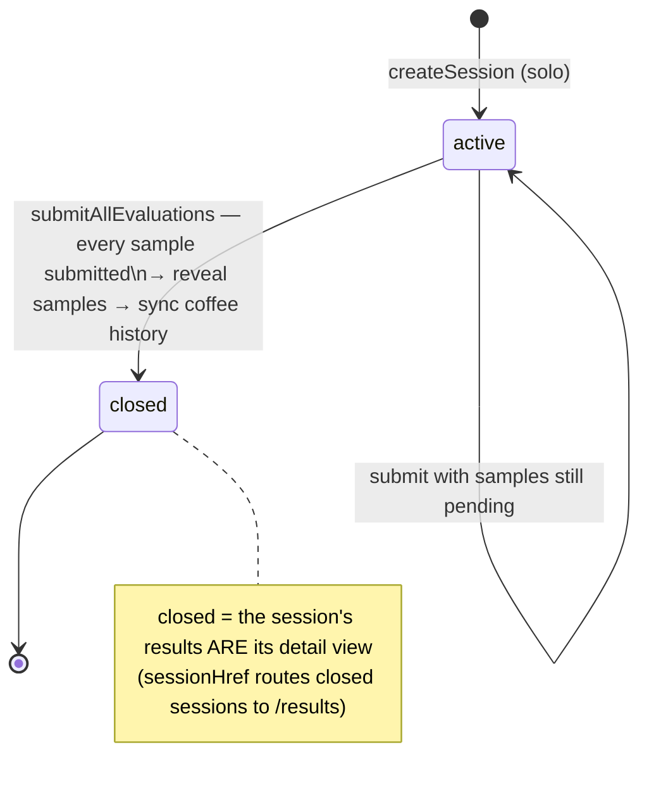
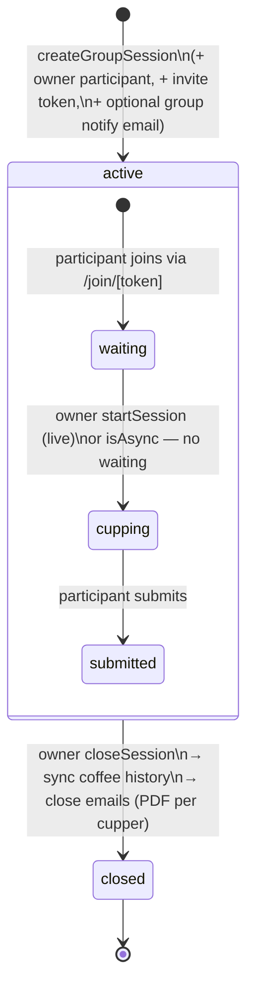
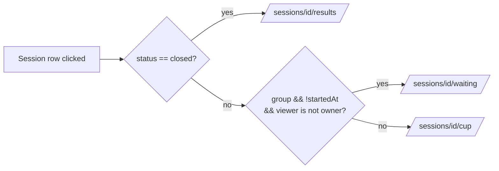
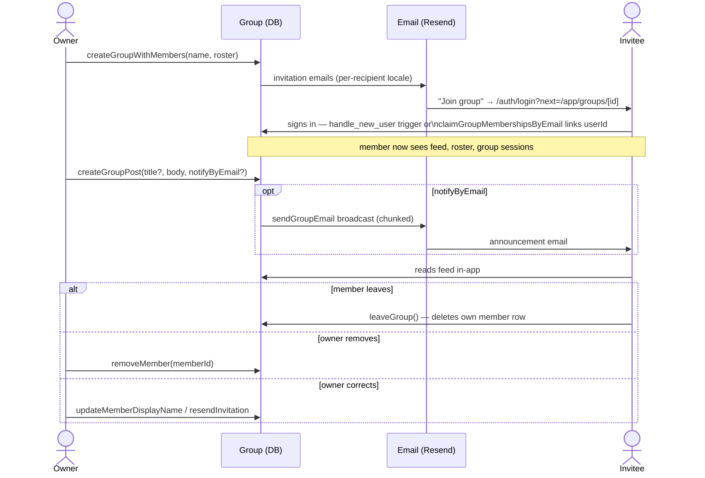

# Cata Café — Application Flows

> **These diagrams are normative.** They describe how the app is *supposed* to behave.
> Update this file **in the same PR** as any change to a flow it documents — a stale
> diagram is worse than none. (Introduced 2026-08-05 with the app-cohesion overhaul.)

Quick orientation: **Sessions** are events, **Coffees** are reusable assets,
**Groups** are standing rosters, and **UserCoffeeHistory** is the connective tissue
that turns closed sessions into per-user coffee track records.

---

## 1. Session lifecycle

Who can do what: the session **owner** (creator) has full CRUD — edit metadata,
manage samples (with guards), reveal, close, delete. A **participant** can only
evaluate and view results. Deleting a session cascades **all participants'
evaluations**, physical/extrinsic data, invites, and its tasting-history rows.

### Solo sessions

`createSession` sets `status: "active"` immediately (there is no meaningful
"draft" for solo). The session **auto-closes** when the owner has a *submitted*
evaluation for **every** sample (`maybeAutoCloseSoloSession` inside
`submitAllEvaluations`, `app/actions/community.ts`): coffee-linked samples are
revealed (solo blind ends at submit), status flips to `closed`, and
`syncCoffeeHistoryForSession` writes `UserCoffeeHistory`.



### Group sessions (live and async)

`createGroupSession` starts at `active`, creates the owner's participant row and
an invite token, and (optionally) emails the linked group. Participants join via
`/join/[token]`. For a **live** session they wait in `/waiting` until the owner
(maestro) calls `startSession` (`startedAt` set); an **async** session
(`closesAt` set) lets them cup immediately. Only the owner closes
(`closeSession`) — that syncs coffee history and emails participants their CVA
PDFs.



### Where a session link takes you (`lib/sessionRouting.ts`)



Every list (sessions, dashboard, profile, group page) must use `sessionHref` —
never hardcode `/cup`.

---

## 2. Coffee visibility & sharing

A coffee is a reusable asset owned by its creator (producer/roaster/café). The
owner has full CRUD (`createCoffee`, `updateCoffee`, `deleteCoffee`,
`setCoffeeVisibility`, `setCoffeeResultsPublished`); everyone else only *uses*
usable coffees in sessions. Two independent switches: `visibility` (who sees the
record) and `resultsPublished` (who sees the aggregated results block).

```mermaid
flowchart TD
    subgraph states [visibility]
        P[private] -- "createCoffeeInvite()\n(link mints ⇒ intent to share)" --> S[shared]
        S -- setCoffeeVisibility --> PUB[public]
        S -- "setCoffeeVisibility(private)\nshare rows stay but go INERT" --> P
        PUB -- setCoffeeVisibility --> S
    end
    S -- "join link /join/coffee/[token]" --> CS[CoffeeShare row\n(per user)]
    CS --> U[usable by that user]
    PUB --> U2[usable by everyone]
    P --> U3[usable by owner only]
```

`usableCoffeeWhere(userId)` (`lib/coffeeAccess.ts`) is the single read rule:
owned ∪ public ∪ (shared ∧ has share row). The session wizard and
`addSessionSample` both re-validate picked coffees against it server-side.

**Delete blast radius:** `session_samples.coffeeId` → SET NULL (samples keep
their blind label; sessions and evaluations survive), but `user_coffee_history`
→ CASCADE for **every user who ever cupped it**. The confirm dialog says so.

---

## 3. Group membership, invites & announcements

Groups are email-first: a `TastingGroupMember` row can exist before the person
has an account. Linking happens two ways: the `handle_new_user` DB trigger on
signup, or `claimGroupMembershipsByEmail` on every groups page load (covers
people who already had an account when invited).

Owner: full CRUD + roster management + announcements + email blasts. Member:
read the group (feed, roster, sessions) and **leave** (`leaveGroup`). There are
no co-admins; being added *is* membership (no pending state).



**Sessions for a group:** the owner creates one from the group page ("Crear
sesión para este grupo" → wizard prefilled via `?groupId=`) or from the wizard
directly; `updateSession` can link/unlink an existing **group** session later.
Solo sessions can never carry a `groupId` (members would get dead links).
Deleting a group keeps its sessions (`groupId` → SET NULL) but deletes members
and posts.

---

## 4. App map — how the sections connect

```mermaid
flowchart TD
    D[Dashboard] -->|recent sessions via sessionHref| SE
    D -->|nueva sesión| NW

    subgraph SE [Sessions]
        SL[List: DataTable\nfilter status/format/role] --> CUP[/cup — evaluate/]
        SL --> ED[/edit — metadata + samples/]
        SL --> RES[/results/]
        NW[New session wizard]
    end

    subgraph CO [Coffees]
        CL[List: DataTable\nfilter process/country/ownership] --> CP[Coffee profile\naggregates + history]
        CP --> CE[/edit/]
    end

    subgraph GR [Groups]
        GL[List] --> GP[Group page\nfeed + roster + sessions]
    end

    PR[Profile\nidentity + stats + settings] --> HI[History: DataTable\nall tasted coffees]

    NW -->|"Usar café existente" picker\n(usableCoffeeWhere)| CO
    NW -->|link groupId + notify| GR
    GP -->|"Crear sesión para este grupo"| NW
    CUP -->|submit-all closes solo session| UCH[(UserCoffeeHistory)]
    RES -->|owner closeSession| UCH
    UCH --> CP
    UCH --> HI
    UCH --> D
```

**The rule that keeps it cohesive:** assets (coffees, groups) are created once
and reused across sessions; sessions produce history; history feeds every
profile/coffee/dashboard number. Owners create/edit/delete what they own —
participants and members only take part.

---

## Maintenance checklist

When you touch any of these, update the matching diagram **in the same PR**:

- Session status transitions or `sessionHref` rules → §1
- `usableCoffeeWhere`, visibility values, share/invite semantics, delete cascades → §2
- Group membership linking, invites, posts, leave/remove → §3
- Any new cross-section navigation or a new consumer of `UserCoffeeHistory` → §4
